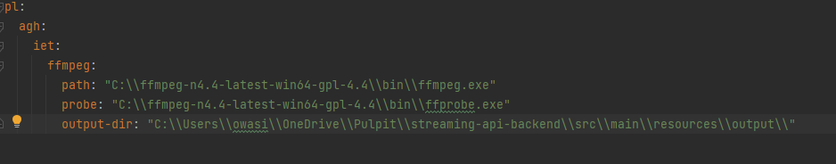

####


#### Environment setup:

1. Go to page: https://github.com/BtbN/FFmpeg-Builds/releases
2. Download ```ffmpeg-n4.4-latest-win64-gpl-4.4.zip``` package
3. Move to your desired dir and setup application.yml properties for ffmpeg and ffprobe 
Example application.yml:

