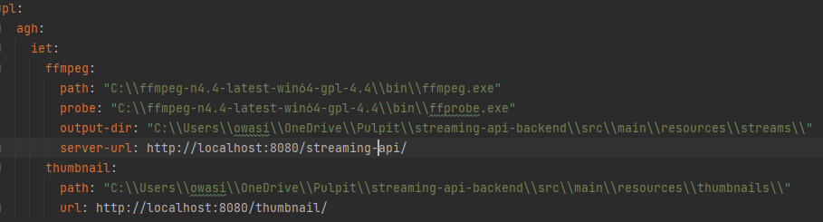

#### Environment setup:

1. Go to page: https://github.com/BtbN/FFmpeg-Builds/releases
2. Download ```ffmpeg-n4.4-latest-win64-gpl-4.4.zip``` package
3. Move to your desired dir and setup application.yml properties for ffmpeg and ffprobe 
4. Setup mongo db database and fill application.yml properties (`spring:data: ...`)
5. Example custom properties for application.yml:



#### To test:
1. Run app
2. Import streaming-api.postman_collection.json
3. Execute `POST Create new video stream` with your args and check if some id is returned
4. Execute `GET Get video details list` and check if your added video is present in response
5. Execute `GET Get M3U8` with proper url param to retrieve master file
6. Execute `DELETE Delete stream` with proper id
7. Execute `GET Get video details list` and check if your added video is NOT present in response